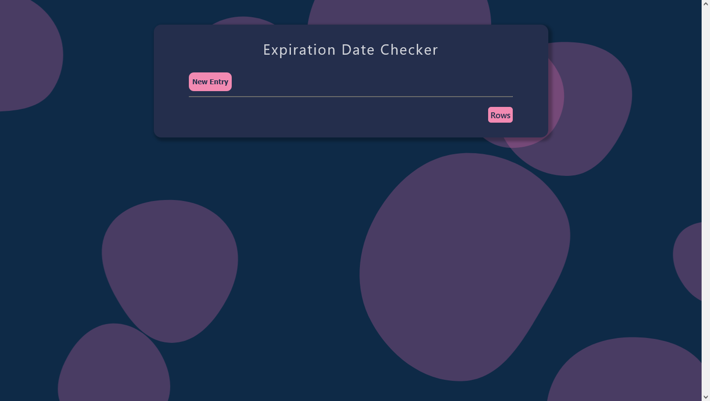

# Personal project

This is personal project to practice adding, editing, and removing data.

## Table of contents

- [Overview](#overview)
  - [The challenge](#the-challenge)
  - [Screenshot](#screenshot)
  - [Links](#links)
- [My process](#my-process)
  - [Built with](#built-with)
- [Author](#author)

## Overview

### The challenge

Users should be able to:

- View the optimal layout for the site depending on their device's screen size
- Add, edit, and remove data to the table

### Screenshot

### Links

- Live Site URL: [Hosted version](https://expiration-date-checker-ml.netlify.app/)

## My process

### Built with

- CSS custom properties
- Mobile-first workflow
- [React.js](https://reactjs.org/)
- [Styled Components](https://styled-components.com/) - For styles

## Author

- Website - [Mairon Romero](https://mairon-romero.netlify.app/)
